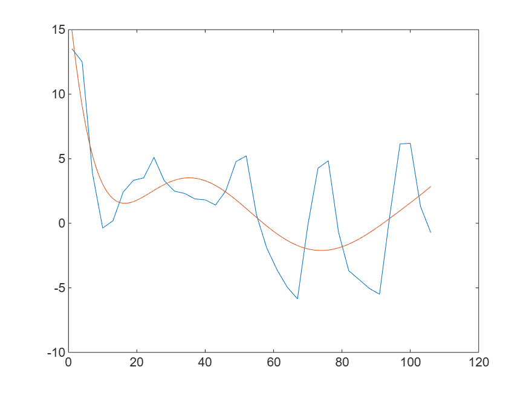

# Weather analysis [](https://matlab.mathworks.com/open/github/v1?repo=yanndebray/weather&file=livescript.mlx)


Open the app in focus mode: [https://matlab.mathworks.com/open/github/v1?repo=yanndebray/weather&file=weather.mlapp&focus=true](https://matlab.mathworks.com/open/github/v1?repo=yanndebray/weather&file=weather.mlapp&focus=true)


Open the live script in focus mode: [https://matlab.mathworks.com/open/github/v1?repo=yanndebray/weather&file=livescript.mlx&focus=true](https://matlab.mathworks.com/open/github/v1?repo=yanndebray/weather&file=livescript.mlx&focus=true) 


2025\-03\-18

<a name="beginToc"></a>

## Table of Contents
&emsp;[Prepare data](#prepare-data)
 
&emsp;&emsp;[Call weather service](#call-weather-service)
 
&emsp;&emsp;[Retime](#retime)
 
&emsp;[Modeling](#modeling)
 
&emsp;&emsp;[Model 1: Linear regression](#model-1-linear-regression)
 
&emsp;&emsp;[Model 2: Polynomial fitting](#model-2-polynomial-fitting)
 
&emsp;[Helper function](#helper-function)
 
<a name="endToc"></a>

# Prepare data
## Call weather service
```matlab
apiKey ="b1b15e88fa797225412429c1c50c122a1";

% Define the location for which you want the weather forecast
cityName = "Muenchen"; 
countryCode = "DE";

% Create the URL for the API call
url = sprintf("http://samples.openweathermap.org/data/2.5/forecast?q=%s,%s&appid=%s", cityName, countryCode, apiKey);
 

% Send the web request to the OpenWeatherMap API
response = webread(url);

% Assuming "response" is the struct obtained from the OpenWeatherMap API
data = parseForecast(response.list);
data = struct2table(data);
data = table2timetable(data);
if false
    data
end 
```

## Retime
```matlab
% Retime timetable
TT = retime(data(:,[1 3 4]),"regular","linear","TimeStep",hours(1));

% Retime each override variable to same time vector
temp2.Vars = ["weather","details"];
temp2.Methods = ["previous","previous"];
temp2.Locations = [2 5];
for k = 1:2
    TT2 = retime(data(:,temp2.Vars(k)),TT.Properties.RowTimes, ...
        temp2.Methods(k));
    TT = addvars(TT,TT2.(1),'Before',temp2.Locations(k), ...
        'NewVariableNames',temp2.Vars(k));
end
clear temp2 k TT2

% Display results
TT
```
| |date|temperature|weather|clouds|wind|details|
|:--:|:--:|:--:|:--:|:--:|:--:|:--:|
|1|16-Feb-2017 12:00:00|13.5200|'Clear'|0|1.8100|'clear sky'|
|2|16-Feb-2017 13:00:00|13.1833|'Clear'|0|1.7367|'clear sky'|
|3|16-Feb-2017 14:00:00|12.8467|'Clear'|0|1.6633|'clear sky'|
|4|16-Feb-2017 15:00:00|12.5100|'Clear'|0|1.5900|'clear sky'|
|5|16-Feb-2017 16:00:00|9.6400|'Clear'|0|1.5300|'clear sky'|
|6|16-Feb-2017 17:00:00|6.7700|'Clear'|0|1.4700|'clear sky'|
|7|16-Feb-2017 18:00:00|3.9000|'Clear'|0|1.4100|'clear sky'|
|8|16-Feb-2017 19:00:00|2.4767|'Clear'|0|1.6867|'clear sky'|
|9|16-Feb-2017 20:00:00|1.0533|'Clear'|0|1.9633|'clear sky'|
|10|16-Feb-2017 21:00:00|-0.3700|'Clear'|0|2.2400|'clear sky'|
|11|16-Feb-2017 22:00:00|-0.1830|'Clear'|25.3333|2.6900|'clear sky'|
|12|16-Feb-2017 23:00:00|0.0040|'Clear'|50.6667|3.1400|'clear sky'|
|13|17-Feb-2017 00:00:00|0.1910|'Clouds'|76|3.5900|'broken clouds'|
|14|17-Feb-2017 01:00:00|0.9333|'Clouds'|76|3.6500|'broken clouds'|

# Modeling
## Model 1: Linear regression
```matlab
 
X = linspace(1,height(TT),height(TT));
y = TT.temperature;
model1 = fitlm(X,y)
```

```matlabTextOutput
model1 = 
Linear regression model:
    y ~ 1 + x1

Estimated Coefficients:
                   Estimate        SE        tStat       pValue  
                   _________    ________    _______    __________

    (Intercept)       4.7728     0.71913     6.6369    1.4829e-09
    x1             -0.061145    0.011668    -5.2404    8.4389e-07

Number of observations: 106, Error degrees of freedom: 104
Root Mean Squared Error: 3.68
R-squared: 0.209,  Adjusted R-Squared: 0.201
F-statistic vs. constant model: 27.5, p-value = 8.44e-07
```

```matlab
% plot(model1)
save("model1.mat","model1")
```

## Model 2: Polynomial fitting
```matlab
 
n = 6;
X = linspace(1,height(TT),height(TT));
y = TT.temperature;
p = polyfit(X,y,n);
y1 = polyval(p,X);
plot(X,y,X,y1)
```



# Helper function
-  [getData.m](getData.m) 
-  [parseForecast.m](parseForecast.m) 
```matlab
function forecastData = parseForecast(responseList)
    % Initialize an array of structs to hold the parsed forecast data
    forecastData = struct("date", {}, "temperature", {}, "weather", {}, "clouds", {}, "wind", {}, "details", {});

    % Loop through each entry in the responseList cell array
    for i = 1:length(responseList)
        % Get the current forecast struct
        forecastStruct = responseList{i};

        % Extract the date and time of the forecast
        forecastData(i).date = datetime(forecastStruct.dt, "ConvertFrom", "posixtime");

        % Extract main forecast data like temperature
        forecastData(i).temperature = forecastStruct.main.temp - 273.15;

        % Extract weather conditions
        forecastData(i).weather = forecastStruct.weather(1).main;

        % Extract cloud data
        forecastData(i).clouds = forecastStruct.clouds.all;

        % Extract wind data
        forecastData(i).wind = forecastStruct.wind.speed;

        % Extract additional details if needed
        forecastData(i).details = forecastStruct.weather(1).description;
    end
end
```

-  [linReg.m](linReg.m) 
```
function y = linReg(X)
    mdl = load("model1.mat");
    model = mdl.model1;
    y = predict(model,X);
```
-  Export Live Script to Markdown 
```
export("livescript.mlx","README.md")
```

-  Add Open in MATLAB Online badge 

`[](https://matlab.mathworks.com/open/github/v1?repo=yanndebray/weather&file=livescript.mlx)`

-  Add [Focused View](https://www.mathworks.com/products/matlab-online/focused-view.html): 

Open the app in focus mode: [https://matlab.mathworks.com/open/github/v1?repo=yanndebray/weather&file=weather.mlapp&focus=true](https://matlab.mathworks.com/open/github/v1?repo=yanndebray/weather&file=weather.mlapp&focus=true)


Open the live script in focus mode: [https://matlab.mathworks.com/open/github/v1?repo=yanndebray/weather&file=livescript.mlx&focus=true](https://matlab.mathworks.com/open/github/v1?repo=yanndebray/weather&file=livescript.mlx&focus=true) 

